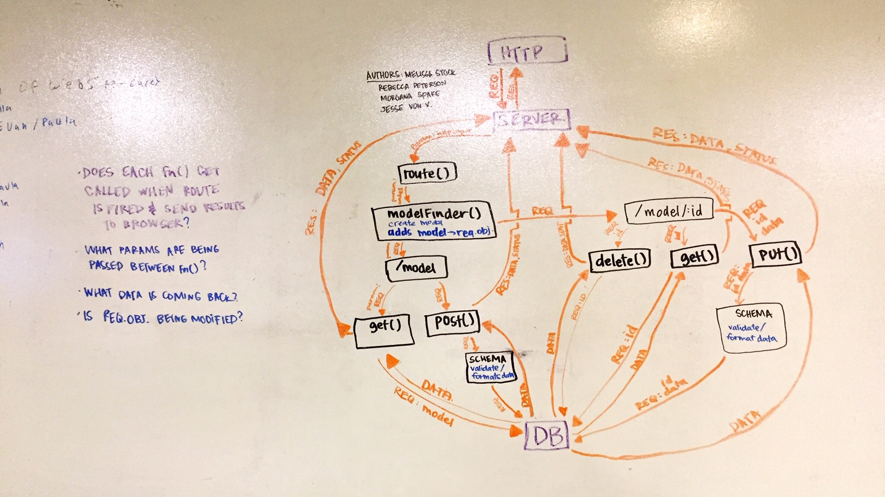

# LAB - 

## Project Name

### Author: Jesse Van Volkinburg

### Links and Resources
* [submission PR](https://github.com/401-advanced-javascript-jv/09-inheritance/pull/1)
* [travis](https://www.travis-ci.com/401-advanced-javascript-jv/09-inheritance)
* [API server](https://infinite-springs-40291.herokuapp.com/)

#### Documentation
* [api docs](https://infinite-springs-40291.herokuapp.com/api/v1/docs) (API servers)
* [jsdoc](https://infinite-springs-40291.herokuapp.com/docs) (Server assignments)

### Modules
#### `teams-model.js`
#### `players-model.js`
#### `categories-model.js`
###### `.get([_id])`
Returns contents of the teams/players/categories collection.
When called with `_id` as a parameter, will provide information about only that record.

###### `.post({...})`
Adds a team/player/category record to the database.

###### `.put(_id, {...})`
Changes the details of the team/player/category with the given id.

###### `.delete(_id)`
Deletes the team/player/category specified by the given id.

### Setup
#### `.env` requirements
* `PORT` - Port Number
* `MONGODB_URI` - URL to the running mongo instance/db

#### Running the app
* `npm start`
* Endpoint: `/api/v1/teams`
* Endpoint: `/api/v1/players`
* Endpoint: `/api/v1/categories`
  * `GET` request - returns a JSON object a list of teams/players/categories
  * `POST` request - inserts a record into the database and returns a JSON object with the new record's contents
* Endpoint: `/api/v1/teams/:id`
* Endpoint: `/api/v1/players/:id`
  * `GET` request - returns a JSON object with the given `:id`
  * `PUT` request - updates the record with the given `:id` and returns a JSON object with the updated details
  * `DELETE` request - deletes the record with the given `:id` and returns the deleted record's details
* Endpoint: `/api/v1/categories/:id`
  * `GET` request - returns a JSON object with the given `:id`
  * `PUT` request - updates the record with the given `:id` and returns a JSON object with the updated details
  * `DELETE` request - deletes the record with the given `:id`
  
#### Tests
* `npm test` to run tests
* What assertions were made?
  - API server
    - ✓ should respond with a 404 on an invalid route (10ms)
    - ✓ should respond with a 404 on an invalid method (3ms)
    - ✓ should be able to post to a valid model (32ms)
    - ✓ following a post to a valid model, should find a single record (10ms)
  - Players model
    - ✓ can post() a new player (4ms)
    - ✓ can get() a player (6ms)
* What assertions need to be made?
  - Need to test 500-error better
  - Need to test the Mongo model
  - Need to test api/v1

#### UML
Collaboration between Rebecca Peterson, Melissa Stock, Morgana Spake, Jesse Van Volkinburg

